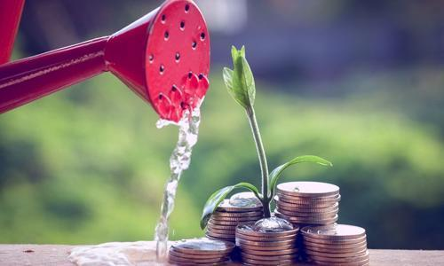

# 斯坦福大学公开课《如何创业》第9课 概要
课程视频：[《第9课 如何融资》](http://open.163.com/movie/2014/9/P/E/MA8CUF9DQ_MA9U7AAPE.html)

## 课程概要
风险投资领域的知名专家（其中包括Ron Conway （罗恩･康伟），硅谷最知名的早期投资公司SV天使投资），解答初创公司融资相关的问题。包括风投投资会考虑哪些方面？怎样拿到融资？融资的过程？各轮融资之间的关系？融资的注意事项等等。

##风投主要考虑哪些方面？

##### Ron Conway 认为考虑投资的因素是多方面的，主要有：

*  初次谈话的这个人是创始人吗？是否正直，专注，痴迷于产品。
* 是什么想要让创始人做这个产品？希望得到答案：创业者是因为自己亲身经历才做出这样的选择。
* 产品是成功的。
* 初创型公司领导是否具有良好的交流能力，要是一位好的沟通者，领导者。至少能掌控局面，有成为领导者的潜力。

##### Marc 认为投资不同阶段的公司，有不同的商业模式。
种子阶段、初创阶段、成长阶段，有不同的针对消费者、公司的商业模式投资。
风险投资，是100%的异类游戏，是极端的例外。主要考虑：
* 该公司是否具有极端异类风投的特点，是否具有成长潜力。
* 优秀的创始人，优秀的创意，完美的产品，可靠的初始客户。

## 如何才能拿到种子投资？
* 让路演的内容简单易懂。
努力让自己用一句话来介绍产品，完美且具有说服力，让投资人明白你的产品。
* 要果断，快速做出决策。让公司在正确的道路上前进。
* 打造一个卓越的团队。
* 尽可能长的时间自给自足。

哈哈，努力建立一个终将超级成功的公司，优秀的无法让别人忽略你，投资人会主动投钱给你。
融到钱并不代表成功，不要把融资看的太重，多想想如何经营好公司，成功招聘人才，让客户病毒式增长，拿到广告收入等。

##融资的过程
##### SV Angel 投资种子阶段过程

从自己的网络里找项目进行初选 → 查看简短的执行摘要 → 投票 →  给创业者打电话 → 约见（投资的概率很大） → 背景调查：公司现状、市场状况等 →  做出投资承诺  → 组成投资财团。

种子阶段，最好的事情就是找对投资人。可以找专业的孵化器（像YC）来引导你。

##### 风投阶段（A轮)一般会投2种类型：

1.已经拿到种子融资。
2.未进行过种子融资。但这类公司的创始人过去要很成功。

由种子投资人向A轮投资公司推荐，融资成功将事半功倍。

##融资和经营公司方面，该怎么去权衡？各轮融资之间有什么关系？
洋葱风险理论：把风险全部罗列出来，一层一层的剥掉解决。
运营创业公司的方式和如何融资是一样的，随着发展将一层层风险剥掉的过程。
先列出所有可能遇到的风险：创始团队的风险，技术风险，产品发布风险，市场风险，收入风险，销售成本风险，病毒增长风险等等。

种子融资是为了避免一开始的2-3个风险，比如创始团队风险、产品风险、观望风险。
A轮融资就是来解决下一阶段的风险，比如招聘风险、客户风险。
种子融资，A轮融资，B轮融资，C轮融资...这每一个阶段公司所处的状态、存在哪些风险，要实现哪些目标，计算出需要多少投资额都是系统且有计划进行的。

## 在种子阶段，A轮融资时，创业者卖掉多少股份比较合适？
* 种子阶段通常是10-15%
* A轮融资可能要卖掉20-30%的股份
天使投资阶段，如果外部投资者占有更多的股份，你自己和团队就会不够分，你就会变成打工者，这样的股权结构会降低团队士气，也不利于接下来的融资。

## 融资过程的一些注意事项
* 不要让投资人和创业者之间签保密协议，要有更多的信任
* 让融资的过程尽可能快的完成。很多投资者的记忆力不太好，如果谈判的过程中做出了投资承诺，你需要把他们说的记下来，发份邮件或者其他方式得到确认。
* 谈判过程中，创始人要找到大家愿意支付的区间范围。

**创建一个公司的时候，如果找到一个和你一样棒或者比你更棒的人做合伙人，成功的机会会几何翻倍。**