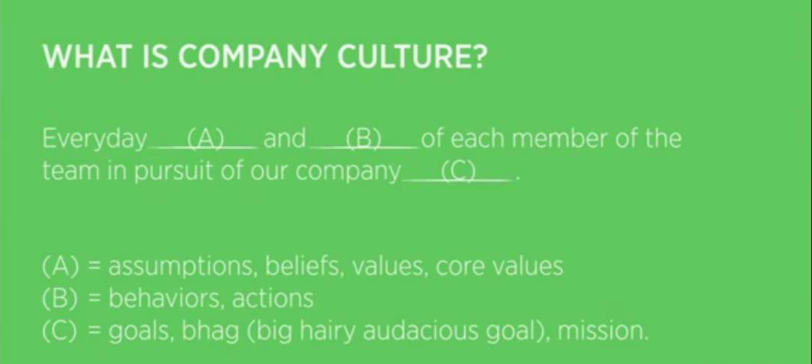

# 斯坦福大学公开课《如何创业》第10课 概要

课程视频：[第10课 文化](https://open.163.com/movie/2014/9/2/T/MA8CUF9DQ_MA9U7NS2T.html)。

## 课程概要
* 阐述了什么是企业文化，为什么它很重要，以及如何创造公司的核心价值。
* Brain 分享他是怎样建立起 爱彼迎(Airbnb) 的文化的。

## 什么是企业文化

企业文化是填充上图 A,B,C 的内容。 可以是由 核心价值观，真实行动，以及公司的愿景 组成。

## 为什么企业文化很重要
* 企业文化是你做事的准则。什么该做，什么不该做。
* 企业文化将与它核心价值观一致的员工聚集在一起。
* 依照企业文化知道该招聘哪些员工，留哪些员工，辞退哪些员工。
* 企业文化帮助公司的业务和团队扩张的更快。

## 如何创造公司的核心价值
创始人扪心自问：  
* 对你来说，最重要的个人价值观有哪些？
* 对企业来说，最重要事情是什么？
* 你喜欢共事的人的是怎样的，他们的价值观是什么？
* 你不喜欢共事的人的是怎样的，他们的价值观是什么？
* 价值观需要支持公司的使命。

公司的核心价值从上面的价值观中提取，筛选。并且要将核心价值塑造成员工的日常习惯。

## Brain 的分享
### 向成功的公司学习
看成功的公司的使命，价值观是怎么样的，是怎样执行的。有条件的可以和那些公司的创始人聊。

### 确定公司的使命和价值观
不管你的产品多厉害，如果不能打造一个伟大的公司，产品也不会持久。那些伟大的公司都有清晰的使命和价值观。比如，乔布斯的核心价值是：有激情的人可以改变世界。(你是想继续卖糖水，还是和我一起来改变世界。)

### 招聘价值观一致的员工
早期的员工会为你公司带入 DNA，如果我们成功的话，之后会有千千万万的这样的人。我们希望招聘那些为了使命而聚在这里的人，不喜欢：因为觉得我们的估值高，喜欢我们的办公室设计或觉得这份工作很热门而来我们这应聘的人。

## 课程中推荐的书籍
* [团队协作的五大障碍](https://book.douban.com/subject/25338822/)