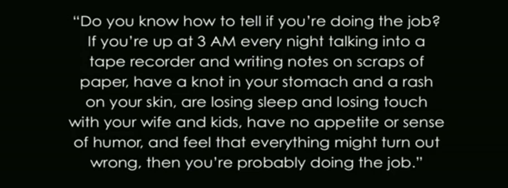

# 斯坦福大学公开课《如何创业》第14课 概要

课程视频：[第14课 如何运营一家公司](https://open.163.com/movie/2014/9/7/C/MA8CUF9DQ_MA9U9AB7C.html)。

## 课程概要
介绍了运营公司的一些技巧。

## 运营公司的目标
打造一个模式：将一些不理性的人(员工)，聚在一起高效的工作(最大化公司的产出)。并且基本上不需要人花时间，每时每刻的盯着。

## 运营公司要做什么
运营公司就像做编辑。编辑要做的事情就是为你的团队澄清和精简事情。其中精简是最重要的，你把事情简化的越多，大家能干得越好。具体包括：  
* 让公司的风格保持一致。人们喜欢一致的东西，减少理解的成本，容易预测。
* 辨别：哪些是值得关注的问题。把主要精力花在解决这些问题上。
* 编辑团队。
  * 找到并留住那些能带领员工，将点子做成产品的人，课程中称之为 “枪筒”。那些具体执行的人，称之为"火药"。
  * 不断扩展员工的职能，直到他们无法胜任。
* 做好细节。 推荐书籍《The Score Takes care of Itself》。考虑你做什么，可以让员工工作的更好。例如：
  * 高性能的电脑。
  * 给员工提供令他们满意的食物。
  * 打造能体现企业文化的办公环境。

要做好以上内容，需要付出巨大的努力。

## 运营公司的一些问题和解答
**如何做到分权，但又不推卸责任？**  
解答：可以参考如下原则：  
* 根据某人处理该任务的熟练度，越熟练，给他们越多的该方面相关的权利。如果某人对该任务不熟练，则少放权，多引导。
* 根据任务的确信程度，和影响程度。对于你确信某事该怎么做，和对公司影响很大的，自己来做。如果你自己也没把握，并且是小事情，应该放权，让员工有机会去试错。

**什么时候雇佣职位更高的人？什么时候给某些人一些指导？什么时候让一个人取代另外一个人？**  
解答：这取决于公司的发展速度和个人的成长速度。如果公司的发展比较慢，员工就老老实实在各自的岗位上呆着。如果公司的发展很快，对于任何个人发展比公司快的，要不断给这个人新的职责。做这些的前提是：追踪每个人的发展速度和公司的成长速度。

**如何让员工的决策和你的决策在同一个平面上？**  
解答： 构建一个仪表盘。量化体现公司的价值定位的值，在仪表盘上体现。比如：我们要打造用户喜欢的产品，那仪表盘上的值可能是： 总用户量，每天的用户新增，留存，流失等参数。

做决策要依赖仪表盘。决策的结果，要让仪表盘的值往好的方向发展。

**公司透明度？**  
解答： 透明度有利于提高员工的工作积极性，减少重复的工作，减少决策失误，减少猜忌。公司的透明度要做到：公司的每个人，知道公司正在进行的每一件事。例如：
* 将董事会上听到的信息传达给员工。
* 会议要做纪要。会议结束后，将会议纪要发给每个人。
* 会议室做成玻璃墙。
* 透明薪酬制度。公司有机会可以尝试，按照等级来定薪资。

**是否需要更多的管理人员？**  
解答： 不需要。提拔专业技能最好的，做管理者（如果他也愿意的话）。因为每个人都会知道，他们的上司比他们更擅长工作，可以从他们领导者上学到东西。从而提高员工士气。他可以在稍后学习管理技能。

## 其他建议
### 管理员工的技巧
* 与下属每周有一次1对1的沟通。最长两周一次。
* 最多只有 5-7 人向你直接汇报工作。
* 控制成员中“枪筒”和“火药”的人的比例。
